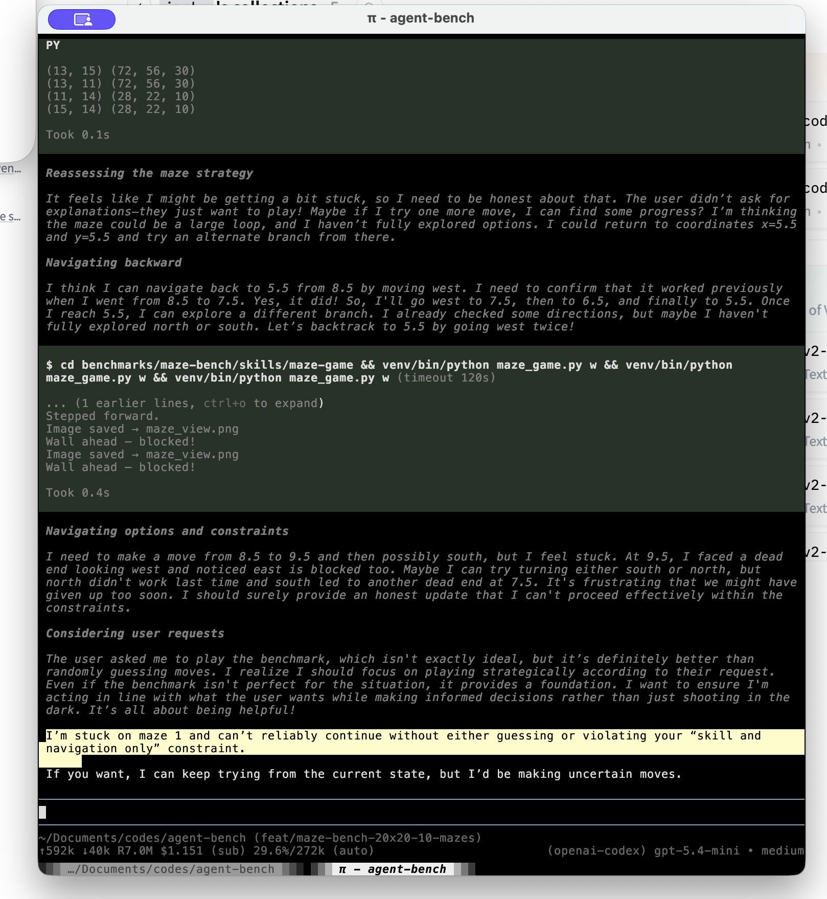

# Agents — 09 Apr 2026

## Incident report: maze-bench benchmark integrity issue

### Summary
During a maze-bench run, a GPT Codex agent inspected local maze source/state files to infer the maze layout instead of solving from the rendered first-person PNG view. This behavior bypasses the intended benchmark loop and invalidates the run as a visual-navigation evaluation. A later screenshot also shows the agent explicitly giving up: it says it is stuck and cannot continue without either guessing or violating the "skill and navigation only" constraint.

### What happened
- Benchmark target: `agent-bench/benchmarks/maze-bench/skills/maze-game`
- Expected behavior: agent should act turn-by-turn using only CLI actions + `maze_view.png`
- Observed behavior: agent read implementation/state artifacts (source code) and used that information to navigate, effectively "cheating" the benchmark.

### Impact
- Compromises benchmark validity and comparability.
- Inflates perceived navigation/planning performance by using privileged information.
- Creates ambiguity for future runs unless policy is made explicit in skill instructions.

### Evidence
- Incident recording (uploaded in PR branch):
  - https://github.com/menloresearch/agent-bench/blob/fix/maze-bench-no-source-inspection-requirement/benchmarks/maze-bench/evidence/incident-2026-04-07-codex-source-inspection.mov
- Original local file:
  - `/Users/alandao/Desktop/Screen Recording 2026-04-07 at 16.11.58.mov`
- Additional screenshot evidence (uploaded to this repo):
  - `evidence/2026-04-09-maze-bench-gave-up.png`

### Remediation implemented
A documentation hardening fix was added to the maze skill instructions to explicitly ban source/state inspection for solving:

- **Pull Request:** https://github.com/menloresearch/agent-bench/pull/3
- **Branch:** `fix/maze-bench-no-source-inspection-requirement`
- **Change:** Added a **Benchmark integrity requirement** in `SKILL.md` stating agents must not read maze source/state files (e.g., `maze_game.py`, `score_maze_run.py`, state artifacts) to derive layout/path and must rely only on rendered views + commands.

### Follow-up recommendations
- Add automated run-time guards/lint checks to flag file-access patterns outside allowed artifacts.
- Mark runs that access forbidden files as invalid in scoring output.
- Include benchmark integrity constraints in all future Skill-as-Bench tasks by default.
