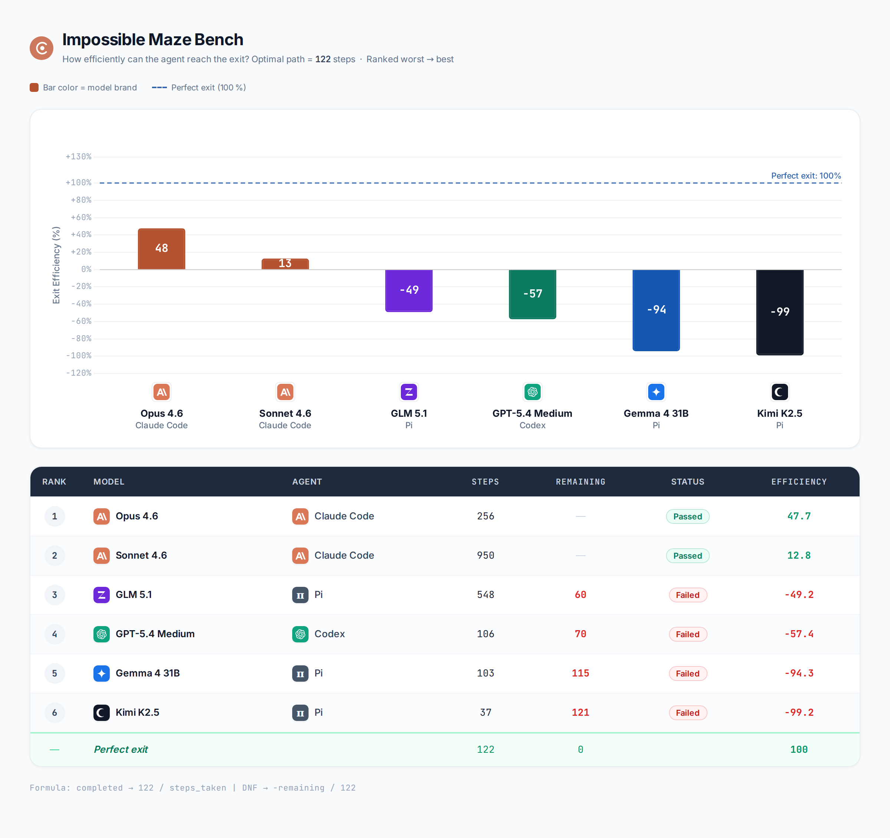

# Agents — 13 Apr 2026

## What I did
- Run Pi coding agent (`@mariozechner/pi-coding-agent`) to route through **OpenRouter** instead of the local vLLM server.
  - Updated `~/.pi/agent/models.json` with the `openrouter` provider and two entries: `z-ai/glm-5.1` and `moonshotai/kimi-k2.5-0127`.
  - Default provider/model switched to `openrouter` / `z-ai/glm-5.1` in `~/.pi/agent/settings.json`.
- Ran maze-bench against two frontier open/closed models via Pi+OpenRouter:
  - **GLM 5.1** (`z-ai/glm-5.1`) — flagship Z.ai model
  - **Kimi K2.5** (`moonshotai/kimi-k2.5-0127`) — Moonshot AI multimodal
- Updated the maze-bench leaderboard (`agent-bench/data/leaderboard/maze-bench.json`) and regenerated the chart.
- Reworked `visualize_maze_bench.py`:
  - Per-model brand-colored bars (Anthropic copper, OpenAI green, Google blue, Moonshot black, Z.ai violet).
  - Model logo centered below each bar with model name (bold) + agent name (muted) stacked underneath.
  - Efficiency number now rendered inside each bar in white (integer, no `%`, no leading `+`).
  - Table column order swapped to **Model → Agent** to match the x-axis legend.
- Added **human play mode** to `maze-bench` in `agent-bench` (latest commit `e60ffbf`, authored as **User** on GitHub):
  - New interactive runner: `benchmarks/maze-bench/skills/maze-game/human_play.py`
  - Updated benchmark docs so a person can drive the same maze manually for sanity checks, demos, and baseline comparison against agent runs.

## Findings / results

### Maze-bench results, 20×20 maze, optimal path = 122 steps

| Rank | Model | Agent | Steps | Remaining | Status | Efficiency |
|------|-------|-------|-------|-----------|--------|-----------|
| 1 | Opus 4.6 | Claude Code | 256 | — | Passed | +47.7 |
| 2 | Sonnet 4.6 | Claude Code | 950 | — | Passed | +12.8 |
| 3 | GLM 5.1 | Pi | 548 | 60 | Failed | -49.2 |
| 4 | GPT-5.4 Medium | Codex | 106 | 70 | Failed | -57.4 |
| 5 | Gemma 4 31B | Pi | 103 | 115 | Failed | -94.3 |
| 6 | Kimi K2.5 | Pi | 37 | 121 | Failed | -99.2 |

Chart: `agents/evidence/13042026-maze-bench-chart.png`

- **GLM 5.1** is the strongest non-Anthropic run so far: it reset the game 4 times, pushed through 548 steps total, and ended **60 steps from the exit** — the closest any failing agent has come. Efficiency -49.2% places it ahead of GPT-5.4, Gemma 4, and Kimi K2.5.
- **Kimi K2.5** crashed mid-run at 37 steps. Only 16 steps of real progress before failure — root cause not yet captured.
- Anthropic models still hold the only passing runs. Opus 4.6 remains the leader at +47.7% efficiency.
- The Pi harness + OpenRouter route is a viable low-friction way to evaluate third-party models on the same `maze-bench` skill without touching the benchmark code.

## NOTE
- Kimi K2.5 crash: no logs captured, so the failure mode (token limit? tool-call schema mismatch? network?) is unknown. Next run needs stderr piped to disk.
- GLM 5.1 "reset" behaviour is unexplained — is the agent deliberately restarting when stuck, or is it a recovery from a wedged state? Needs a trace.
- Human play mode should make it easier to validate maze difficulty by hand and compare human navigation traces against model behaviour.
